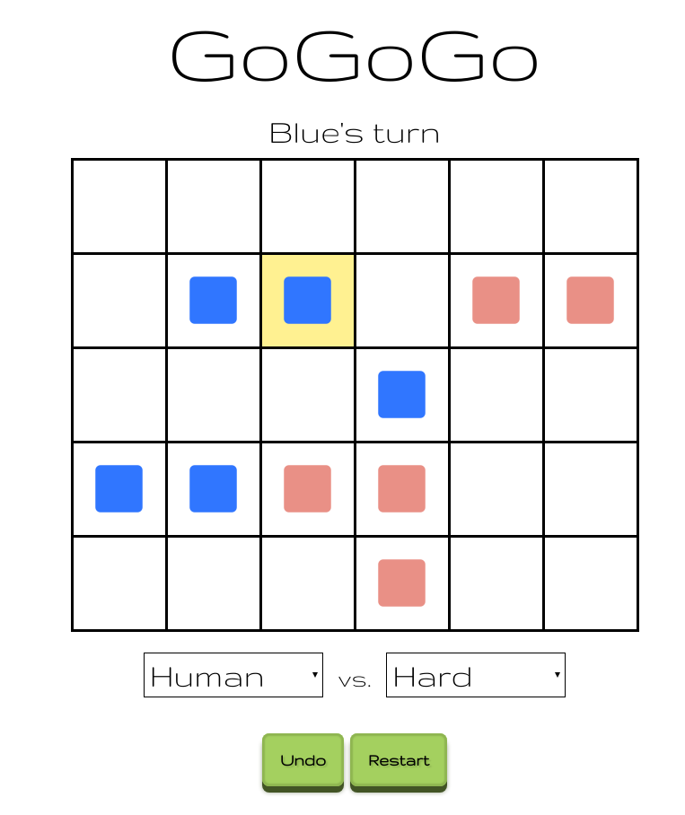

# gogogo
Abstract Strategy Game

[https://timothyearley.github.io/gogogo/](https://timothyearley.github.io/gogogo/)

## Rules
- Each turn you may move one of your pieces to an adjacent square (up, down, left, right).
- You may push _one_ piece along with you, but not more.
- The pushed piece may not move during the next player's turn.
- Pieces pushed of an edge are out of the game.
- The goal is to reach the other side with one of your pieces. Or alternativly make your opponent incaple of moving.

## Playing

Movable pieces are highlighted. Click to select and click again to choose destination.

## Screenshot

